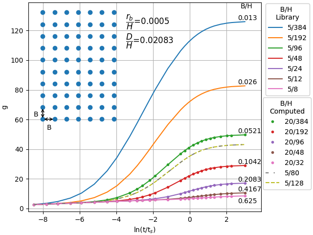
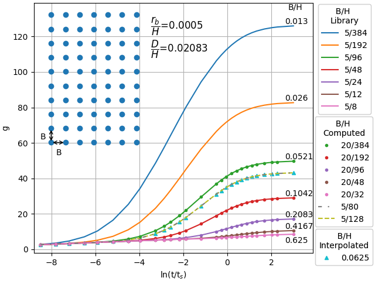

.. statistics:

****************************
Dimensioning Rules Example
****************************
A 7x10 borefield is chosen to verify the dimensioning rules of Per Eskilson (1988) :cite:`Eskilson_1988`. These g-functions
have been computed using the methodology of Cimmino and Bernier (2014) :cite:`Cimmino_Bernier_2014`. The uniform
borehole wall temperature (UBHWT) boundary condition with 12 segments is used, this was the closest when compared
to Eskilson. Specifically, this is boundary condition 3 in Cimmino and Bernier (2014). Cimmino went on to implement the g-function calculation
in an open source Python package known as `pygfunction <https://github.com/MassimoCimmino/pygfunction>`_,
which is published on the `Python Package Index (PyPI) <https://pypi.org/project/pygfunction/>`_ :cite:`pygfunction`.
Further improvements to the g-function calculation methodology are detailed in Cimmino (2018)
:cite:`Cimmino_2018`. The g-functions in this example are computed using a computationally improved version of
Massimo Cimmino's methodology, which is discussed in Cook and Spitler (2021) :cite:`Cook_Spitler_2021`.
All of the g-functions in this example were computed using the same dimensionless borehole radius, rb/H,
and burial depth, D/H, ratios.

Compute g-Functions with varied B/H Ratios
--------------------------------------------
To ensure that the g-function does scale with the dimensionless parameters, g-functions varying different heights
are computed for borefields with uniform spacing of 5 and 8 meters. The boundary condition used is uniform borehole wall
temperature (UBHWT). There is an additional two g-functions computed with a B/H=0.0625. The following tables display the
inputs used:

.. raw:: html

    <embed>
    
    <table class="tg">
    <caption>The inputs for the B=5m g-functions computed (7x10 borefield)</caption>
    <thead>
      <tr>
        <th class="tg-7btt">D (m)</th>
        <th class="tg-7btt">H (m)</th>
        <th class="tg-7btt">rb (m)</th>
        <th class="tg-7btt">B (m)</th>
        <th class="tg-7btt">alpha (m2/s)</th>
        <th class="tg-7btt">nSegments (-)</th>
      </tr>
    </thead>
    <tbody>
      <tr>
        <td class="tg-c3ow">0.16667</td>
        <td class="tg-c3ow">8</td>
        <td class="tg-c3ow">0.004</td>
        <td class="tg-c3ow">5</td>
        <td class="tg-c3ow">1E-06</td>
        <td class="tg-c3ow">12</td>
      </tr>
      <tr>
        <td class="tg-c3ow">0.25</td>
        <td class="tg-c3ow">12</td>
        <td class="tg-c3ow">0.006</td>
        <td class="tg-c3ow">5</td>
        <td class="tg-c3ow">1E-06</td>
        <td class="tg-c3ow">12</td>
      </tr>
      <tr>
        <td class="tg-c3ow">0.5</td>
        <td class="tg-c3ow">24</td>
        <td class="tg-c3ow">0.012</td>
        <td class="tg-c3ow">5</td>
        <td class="tg-c3ow">1E-06</td>
        <td class="tg-c3ow">12</td>
      </tr>
      <tr>
        <td class="tg-c3ow">1</td>
        <td class="tg-c3ow">48</td>
        <td class="tg-c3ow">0.024</td>
        <td class="tg-c3ow">5</td>
        <td class="tg-c3ow">1E-06</td>
        <td class="tg-c3ow">12</td>
      </tr>
      <tr>
        <td class="tg-c3ow">2</td>
        <td class="tg-c3ow">96</td>
        <td class="tg-c3ow">0.048</td>
        <td class="tg-c3ow">5</td>
        <td class="tg-c3ow">1E-06</td>
        <td class="tg-c3ow">12</td>
      </tr>
      <tr>
        <td class="tg-c3ow">4</td>
        <td class="tg-c3ow">192</td>
        <td class="tg-c3ow">0.096</td>
        <td class="tg-c3ow">5</td>
        <td class="tg-c3ow">1E-06</td>
        <td class="tg-c3ow">12</td>
      </tr>
      <tr>
        <td class="tg-c3ow">8</td>
        <td class="tg-c3ow">384</td>
        <td class="tg-c3ow">0.192</td>
        <td class="tg-c3ow">5</td>
        <td class="tg-c3ow">1E-06</td>
        <td class="tg-c3ow">12</td>
      </tr>
    </tbody>
    </table>
    </embed>

.. raw:: html

    <embed>
    
    <table class="tg">
    <caption>The inputs for the B=20m g-functions computed (7x10 borefield)</caption>
    <thead>
      <tr>
        <th class="tg-7btt">D (m)</th>
        <th class="tg-7btt">H (m)</th>
        <th class="tg-7btt">r_b (m)</th>
        <th class="tg-7btt">B (m)</th>
        <th class="tg-7btt">alpha ((m2/s)</th>
        <th class="tg-7btt">nSegments (-)</th>
      </tr>
    </thead>
    <tbody>
      <tr>
        <td class="tg-c3ow">0.66667</td>
        <td class="tg-c3ow">32</td>
        <td class="tg-c3ow">0.016</td>
        <td class="tg-c3ow">20</td>
        <td class="tg-c3ow">1E-06</td>
        <td class="tg-c3ow">12</td>
      </tr>
      <tr>
        <td class="tg-c3ow">1</td>
        <td class="tg-c3ow">48</td>
        <td class="tg-c3ow">0.024</td>
        <td class="tg-c3ow">20</td>
        <td class="tg-c3ow">1E-06</td>
        <td class="tg-c3ow">12</td>
      </tr>
      <tr>
        <td class="tg-c3ow">2</td>
        <td class="tg-c3ow">96</td>
        <td class="tg-c3ow">0.048</td>
        <td class="tg-c3ow">20</td>
        <td class="tg-c3ow">1E-06</td>
        <td class="tg-c3ow">12</td>
      </tr>
      <tr>
        <td class="tg-c3ow">4</td>
        <td class="tg-c3ow">192</td>
        <td class="tg-c3ow">0.096</td>
        <td class="tg-c3ow">20</td>
        <td class="tg-c3ow">1E-06</td>
        <td class="tg-c3ow">12</td>
      </tr>
      <tr>
        <td class="tg-c3ow">8</td>
        <td class="tg-c3ow">384</td>
        <td class="tg-c3ow">0.192</td>
        <td class="tg-c3ow">20</td>
        <td class="tg-c3ow">1E-06</td>
        <td class="tg-c3ow">12</td>
      </tr>
    </tbody>
    </table>
    </embed>

Thus, the dimensionless ratios used:
    - D/H = 0.02083
    - rb/H = 0.0005
    - B/H (varies)
    - ln(t/ts) - Eskilsons original 27 points
        .. code-block:: python

            ln(t/ts)_values = [-8.5, -7.8, -7.2, -6.5, -5.9, -5.2, -4.5, -3.963, -3.27, -2.864, -2.577, -2.171,
            -1.884, -1.191, -0.497, -0.274, -0.051, 0.196, 0.419, 0.642, 0.873, 1.112, 1.335, 1.679, 2.028, 2.275, 3.003]

The additional g-functions computed with a B/H=0.0625 is given in the following table:

.. raw:: html

    <embed>
    
    <table class="tg">
    <caption>Additional g-functions computed with specifically a B/H ratio of 0.0625</caption>
    <thead>
      <tr>
        <th class="tg-7btt">D (m)</th>
        <th class="tg-7btt">H (m)</th>
        <th class="tg-7btt">r_b (m)</th>
        <th class="tg-7btt">B (m)</th>
        <th class="tg-7btt">alpha ((m2/s)</th>
        <th class="tg-7btt">nSegments (-)</th>
      </tr>
    </thead>
    <tbody>
      <tr>
        <td class="tg-c3ow">2.66667</td>
        <td class="tg-c3ow">128</td>
        <td class="tg-c3ow">0.064</td>
        <td class="tg-c3ow">8</td>
        <td class="tg-c3ow">1E-06</td>
        <td class="tg-c3ow">12</td>
      </tr>
      <tr>
        <td class="tg-c3ow">1.66667</td>
        <td class="tg-c3ow">80</td>
        <td class="tg-c3ow">0.04</td>
        <td class="tg-c3ow">5</td>
        <td class="tg-c3ow">1E-06</td>
        <td class="tg-c3ow">12</td>
      </tr>
    </tbody>
    </table>
    </embed>

The g-functions from the input tables above are plotted in the :numref:`dr_fig_1`. The g-functions computed for the
borefield with a uniform spacing, B=5m, are listed in the `B/H library` legend. This was done because
this is like what will be in the library. The g-functions computed using the uniform spacing, B=20m, are listed
in the `B/H Computed` legend. The g-functions which have the same `B/H` value for the 5m and 20m spacing fields
are computed with the same color. There are two additional g-function curves computed for a B/H=0.0625, which
will be used as reference for interpolation later on.

    g-Functions plotted with the same rb/H, D/H and borehole layout (7x10), but with
    varied B/H values

Additionally, mean percentage errors (computed with :py:meth:`gFunctionLibrary.statistics.mpe`) are presented
in the table below.

.. raw:: html

    <embed>
    
    <body>
    <table class="center, tg">
    <caption>Mean percent errors for g-functions with the same B/H, and also computed using a separate B/H</caption>
    <thead>
      <tr>
        <th class="tg-c3ow">B</th>
        <th class="tg-c3ow">H0 </th>
        <th class="tg-c3ow">H1</th>
        <th class="tg-baqh">H2</th>
        <th class="tg-baqh">H3</th>
        <th class="tg-baqh">H4</th>
      </tr>
    </thead>
    <tbody>
      <tr>
        <td class="tg-c3ow">5 </td>
        <td class="tg-c3ow">96 </td>
        <td class="tg-c3ow">48</td>
        <td class="tg-baqh">24</td>
        <td class="tg-baqh">12</td>
        <td class="tg-baqh">8</td>
      </tr>
      <tr>
        <td class="tg-c3ow">20</td>
        <td class="tg-c3ow">384</td>
        <td class="tg-c3ow">192</td>
        <td class="tg-baqh">96</td>
        <td class="tg-baqh">48</td>
        <td class="tg-baqh">32</td>
      </tr>
      <tr>
        <td class="tg-c3ow">MPE (%)</td>
        <td class="tg-c3ow">4.028e-05 </td>
        <td class="tg-c3ow">-8.7e-06</td>
        <td class="tg-baqh">5.5e-04</td>
        <td class="tg-baqh">1.381e-02</td>
        <td class="tg-baqh">-4.759e-02</td>
      </tr>
    </tbody>
    </table>
    </body>
    </embed>

Interpolation
---------------
The g-functions computed with B/H ratios of 0.0625 were computed and are displayed in :numref:`dr_fig_1` to have a
reference for checking the accuracy of interpolation using the `B/H Library` g-functions (all containing a B spacing of
5m). The mean percent errors for different methods of interpolation can be seen in the table below.

.. raw:: html

    <embed>
    
    <table class="tg">
    <caption>Mean percentage error of interpolation for a B/H=0.0625 using different interpolation methods</caption>
    <thead>
      <tr>
        <th class="tg-c3ow">Interpolation Method</th>
        <th class="tg-7btt">MPE (%)</th>
      </tr>
    </thead>
    <tbody>
      <tr>
        <td class="tg-c3ow">linear</td>
        <td class="tg-c3ow"> -0.30</td>
      </tr>
      <tr>
        <td class="tg-c3ow">quadratic </td>
        <td class="tg-c3ow">-0.05 </td>
      </tr>
      <tr>
        <td class="tg-c3ow">cubic</td>
        <td class="tg-c3ow">-0.02 </td>
      </tr>
      <tr>
        <td class="tg-c3ow">lagrange</td>
        <td class="tg-c3ow">1.04 </td>
      </tr>
    </tbody>
    </table>
    </embed>

An interpolated g-function (using `cubic interpolation`) is now plotted on an updated :numref:`dr_fig_2`.

    An interpolated g-function curve of B/H=0.0625 is interpolated for using g-functions computed with
    a uniform spacing of 5m and ranging heights

Source Code
--------------

.. literalinclude:: ../../../gFunctionLibrary/examples/dimensioning_rules.py
    :language: python
    :linenos:
