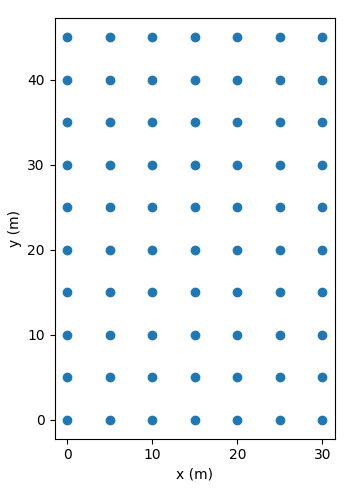
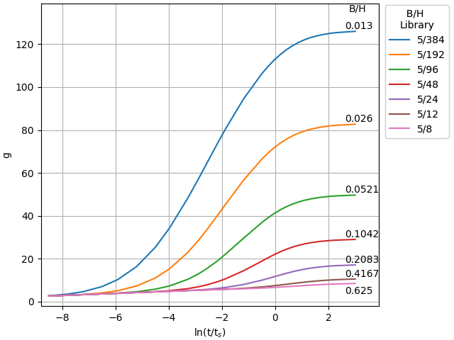
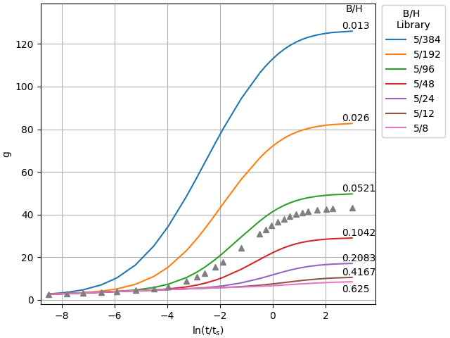

.. interpolation_1D:

***************************************
1D Interpolation for B/H, D/H, rb/H
***************************************
A precursor to this example may be the :doc:`dimensioning_rules`.

Computing Library-like g-Functions
-------------------------------------
A 7x10 borehole field is created using https://github.com/j-c-cook/Rectangle-Bore-Field-Generator. That
layout can be seen in :numref:`interp_1D_fig_1`.

    7x10 borefield layout with 5m uniform spacing

A library like range of g-functions are computed using the following inputs.

.. raw:: html

    <embed>
    
    <table class="tg">
    <caption>The inputs for the B=5m g-functions computed (7x10 borefield)</caption>
    <thead>
      <tr>
        <th class="tg-7btt">D (m)</th>
        <th class="tg-7btt">H (m)</th>
        <th class="tg-7btt">rb (m)</th>
        <th class="tg-7btt">B (m)</th>
        <th class="tg-7btt">alpha (m2/s)</th>
        <th class="tg-7btt">nSegments (-)</th>
      </tr>
    </thead>
    <tbody>
      <tr>
        <td class="tg-c3ow">0.16667</td>
        <td class="tg-c3ow">8</td>
        <td class="tg-c3ow">0.004</td>
        <td class="tg-c3ow">5</td>
        <td class="tg-c3ow">1E-06</td>
        <td class="tg-c3ow">12</td>
      </tr>
      <tr>
        <td class="tg-c3ow">0.25</td>
        <td class="tg-c3ow">12</td>
        <td class="tg-c3ow">0.006</td>
        <td class="tg-c3ow">5</td>
        <td class="tg-c3ow">1E-06</td>
        <td class="tg-c3ow">12</td>
      </tr>
      <tr>
        <td class="tg-c3ow">0.5</td>
        <td class="tg-c3ow">24</td>
        <td class="tg-c3ow">0.012</td>
        <td class="tg-c3ow">5</td>
        <td class="tg-c3ow">1E-06</td>
        <td class="tg-c3ow">12</td>
      </tr>
      <tr>
        <td class="tg-c3ow">1</td>
        <td class="tg-c3ow">48</td>
        <td class="tg-c3ow">0.024</td>
        <td class="tg-c3ow">5</td>
        <td class="tg-c3ow">1E-06</td>
        <td class="tg-c3ow">12</td>
      </tr>
      <tr>
        <td class="tg-c3ow">2</td>
        <td class="tg-c3ow">96</td>
        <td class="tg-c3ow">0.048</td>
        <td class="tg-c3ow">5</td>
        <td class="tg-c3ow">1E-06</td>
        <td class="tg-c3ow">12</td>
      </tr>
      <tr>
        <td class="tg-c3ow">4</td>
        <td class="tg-c3ow">192</td>
        <td class="tg-c3ow">0.096</td>
        <td class="tg-c3ow">5</td>
        <td class="tg-c3ow">1E-06</td>
        <td class="tg-c3ow">12</td>
      </tr>
      <tr>
        <td class="tg-c3ow">8</td>
        <td class="tg-c3ow">384</td>
        <td class="tg-c3ow">0.192</td>
        <td class="tg-c3ow">5</td>
        <td class="tg-c3ow">1E-06</td>
        <td class="tg-c3ow">12</td>
      </tr>
    </tbody>
    </table>
    </embed>

It should be noted that this corresponds to an rb/H = 0.0005 and D/H = 0.02083.

The g-functions are visualized in :numref:`interp_1D_fig_2`

    The g-functions for the 7x10 borefield from :numref:`interp_1D_fig_1`

Interpolation for g, D, rb
-------------------------------
The table above gives the input values. It can be seen that there are varying D and rb
values to keep the D/H ratio and rb/H ratio constant. Therefore, interpolating for a g-function
using a B/H ratio will also result in a new rb and D value, though in this case the rb/H
and D/H ratios should remain the same even after interpolation.

A B and H value of 8m and 128m are respectively selected for this interpolation example. This corresponds
to a B/H of 0.0625, therefore the interpolated value should fall in between the green and red curves
in :numref:`interp_1D_fig_2`. That corresponds to rb values in a range of 0.024m-0.048m and D values to fall within
1m-2m. The resulting output is the following:

.. code-block:: python

        rb = 0.0400	rb/H_eq = 0.0005
        D = 1.66667	D/H_eq = 0.02083

The interpolated rb/H and D/H ratios make sense. However, notice that the height is referred to as `H_eq` or
an equivalent height. This is what is returned from calling the interpolation function,
:func:`gFunctionLibrary.handle_contents.Borefield.g_function_interpolation`. This occurs because the interpolation for
a new g-function is a function that is dependent on height.

.. math::

    g(ln(t_i/t_s), H_j) = f(H_j)_i

Where `f` could be any method of interpolation: linear, quadratic, cubic, lagrange, etc. This function is originally
fit with as many points as there are curves in the library for a particular configuration.

The interpolated g-functions accuracy has already been proven in :doc:`dimensioning_rules`. The interpolated
g-function is added and the plot presented in :numref:`interp_1D_fig_3`

    The g-functions for the 7x10 borefield and an interpolated g-function for a
    B/H=0.0625

Source Code
--------------

.. literalinclude:: ../../../gFunctionDatabase/examples/interpolation_1D.py
    :language: python
    :linenos: