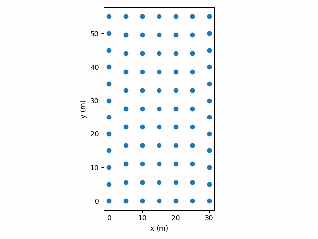

.. ZRectExample:

**********************************
Generate Zoned Rectangle
**********************************
This example shows how to make use of :func:`gFunctionLibrary.coordinate_generator.ZonedRectangle`
to create a series of rectangles with an outer perimeter (fixed spacing) base case
of 7x12.

    A gif of the systematic reduction of rows or columns for a zoned rectangle
    - whichever one will
    have the most uniform interior spacing. Ends with 1 borhole in center of
    field.

The files are stored in a key: value dictionary. The key for zoned rectangles is created in the function
:func:`gFunctionLibrary.coordinate_generator.ZonedRectangle.hash_key`.

.. table:: The Nix and Niy values that are created, note that 5x10 interior would make the rectangle a uniform spaced
            field and is not included in the zoned rectangular library

    +-----+---+---+---+---+---+---+---+---+---+---+---+---+---+
    | Nix | 5 | 4 | 4 | 4 | 3 | 3 | 3 | 2 | 2 | 1 | 1 | 1 | 1 |
    +-----+---+---+---+---+---+---+---+---+---+---+---+---+---+
    | Niy | 9 | 9 | 8 | 7 | 7 | 6 | 5 | 5 | 4 | 4 | 3 | 2 | 1 |
    +-----+---+---+---+---+---+---+---+---+---+---+---+---+---+

Source Code
--------------
.. literalinclude:: ../gFunctionLibrary/Libraries/examples/gen_zonedrectangle_coordinates.py
    :language: python
    :linenos:
